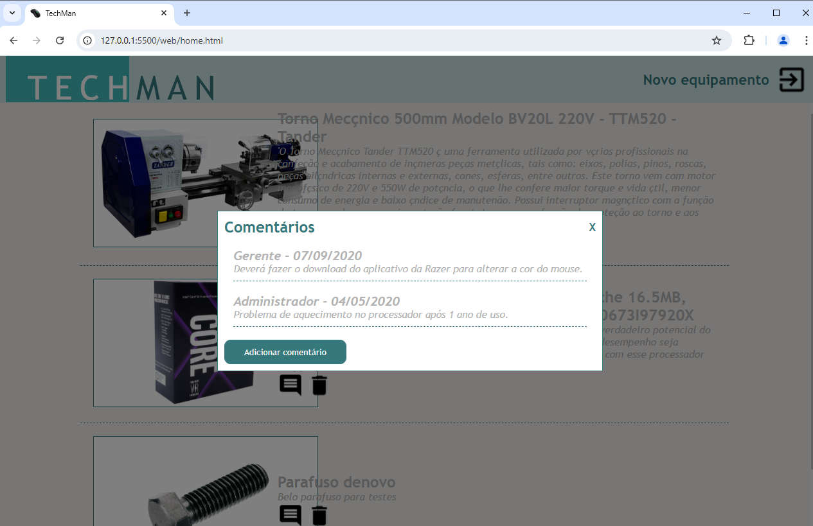

# TechMan Web Application
Front-End do projeto TechMan, desenvolvido com HTML, CSS e JavaScript.

## Para acessar a aplicação
Utilize a senha de perfil 111111 para acessar como usuário comum ou 212121 para acessar como administrador.

## Passos para executar a UI(User Interface) localmente
1. Após clonar o repositório e execute a **API e migração do BD** localmente seguindo os passos em ./api/README.md
3. Abra o arquivo `index.html` no seu navegador, de preferência o Google Chrome e executando com a extensão Live Server.

## Screenshots

